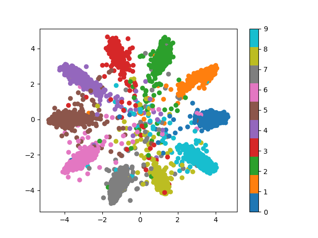
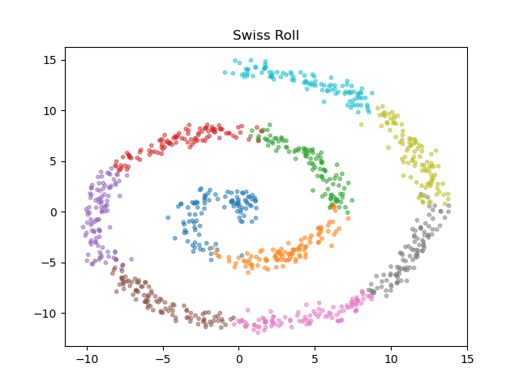

# Machine Learning Playground
A collection of ML code playground

## Setup environment

Run the bash script ```setup.sh``` to install python packages via conda.

## Variational AutoEncoder (VAE)

### Implementation

This repository contains several implementations of VAE

1. Standard implementation with a reduced loss form in the original paper [[paper]](https://arxiv.org/abs/1312.6114)

```bash
python vae_train.py
```

2. Alternative implementation accepts distributions with a known density propability function. This implementation remove limitations in the standard implementation. 

## Conditional Variational AutoEncoder (cVAE)

### Implementation

```bash
python cvae_case1.py
python cvae_case2.py
python cvae_case3.py
```

### Some results



## Adversarial AutoEncoder (AAE)

[[Paper]](https://arxiv.org/abs/1511.05644)

"Adversarial autoencoder" (AAE) is a probabilistic autoencoder that uses the recently proposed generative adversarial networks (GAN) to perform variational inference by matching the aggregated posterior of the hidden code vector of the autoencoder with an arbitrary prior distribution. Matching the aggregated posterior to the prior ensures that generating from any part of prior space results in meaningful samples. As a result, the decoder of the adversarial autoencoder learns a deep generative model that maps the imposed prior to the data distribution.

To launch training code for the experiments in the paper,

```bash
python aae_conditional_train.py # 10 GMM 2D distribution
python aae_swiss_roll.py # Swiss roll distribution
```

### Some results

Target distribution



Reconstructed distribution

