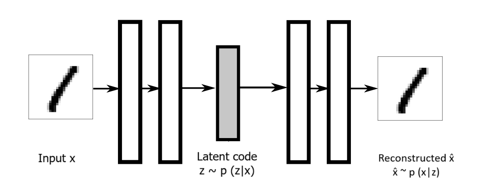
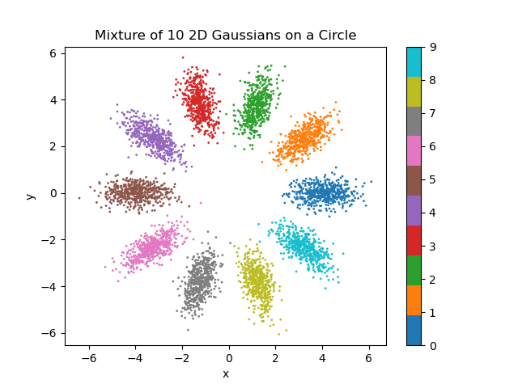
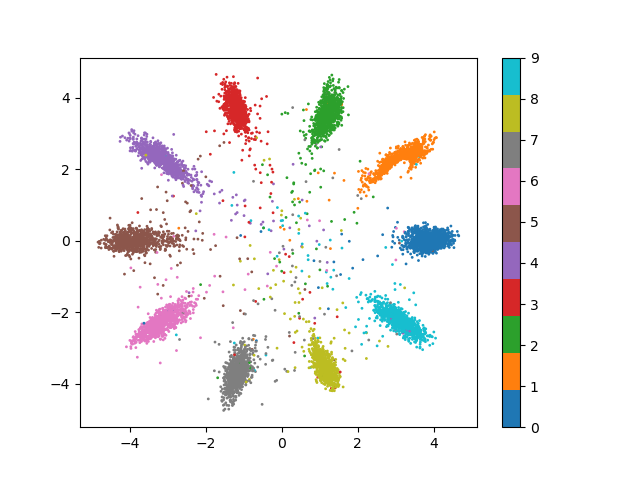
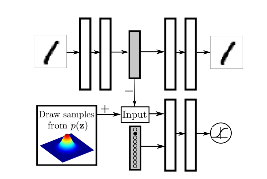
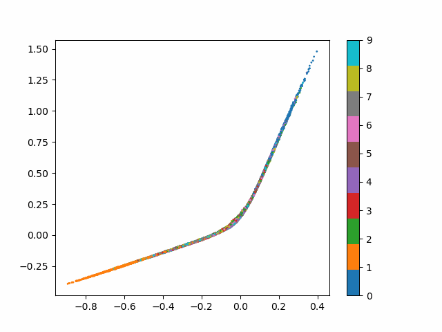
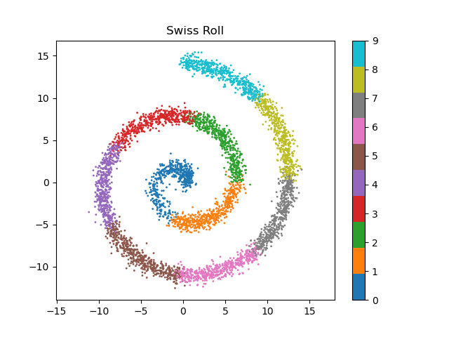
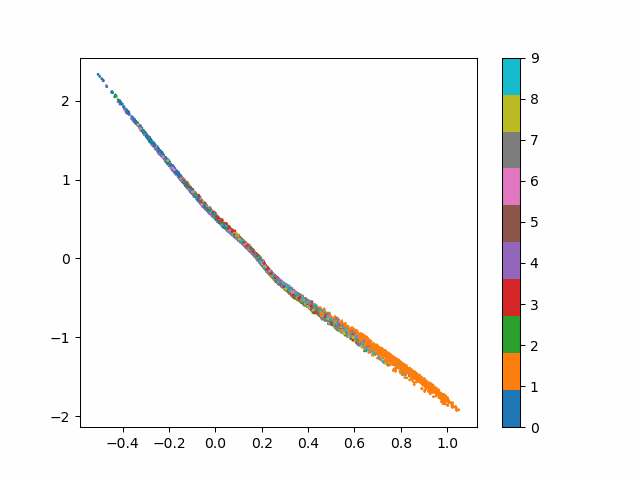
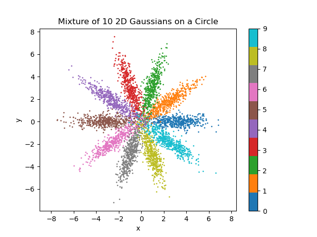

# Machine Learning Playground

My reimplementation of several ML papers (VAE, AAE)

## Setup environment

Run the bash script ```setup.sh``` to install python packages via conda.

## Variational AutoEncoder (VAE)



Variational AutoEncoder is a well-known neural net architecture, which encodes data into a latent space where encoded data distribution is imposed by a given prior distribution. This allows us to have more control over the latent representation, comparing to the vanilla AutoEncoder.

### Implementation

This repository contains my reimplementations of VAE

1. Standard implementation with a reduced loss form in the original paper [[paper]](https://arxiv.org/abs/1312.6114). According the paper, one particular point is the reparameterization trick which is proposed to overcome the problem of gradient estimation through statistic node (e.g. latent code z). With some awesome simplifications, the author reduced the overall loss form (one is a reconstruction lost and the other is the KL divergence) to a simple formula (please see the appendix of the paper). Therefore, the training is straightforward. However, these simplifications are obtained due to the fact that we have access the closed form of the KL divergence. The VAE models are available in the folder ``models/legacy``.

2. After thoroughly reading some blogs [[link1](https://beckham.nz/2023/04/27/conditional-vaes.html), [link2](https://mbernste.github.io/posts/vae/)] about Variational Inference and Variational AutoEncoder, here is an alternative implementation that accepts distributions with a known density propability function. This implementation leverages limitations in the standard implementation. Unlike the original VAE implementations, this alternative only requires the prior probability function q(z), not the closed form of the KL divergence. To prove this advantage, in the experiment for a mixture of 10 2D **non-isotropic** Gaussians, the closed form of KL divergence is supposed to be unknown. The solution is to use Monte Carlo (MC) approximation to compute the KL divergence. This requires sufficient samples on latent space while doing the approximation. In all exps, we use 256 samples for 2D-latent space. This might be come a problem if latent space is high-dimensional, as higher dimension latent space is, more samples are required for effective MC approximation. The alternative VAE models are available in the folder ``models/experimental``.

The code below is to re-run the experiment.

```bash
python vae_train.py
```

### Conditional Variational AutoEncoder (cVAE)

To extend the use of the alternative VAE described in the previous section, we learn a latent space where each number is a Gaussian distribution via Conditional VAE. this means that we have an explicit control over latent space. Here is some results.

| Target prior distribution | Learned latent space |
| ------------------------- | -------------------- |
| |  |

Re-run the code below to reproduce the experiment.

```bash
python cvae_train.py
```

## Adversarial AutoEncoder (AAE)

In the case where we don't even have access to prior distribution function, but we can only sample them, **what can we do?**. That is what **Adversarial AutoEncoder (AAE)** for.

[[Paper]](https://arxiv.org/abs/1511.05644)



"Adversarial autoencoder (AAE) is a probabilistic autoencoder that uses the recently proposed generative adversarial networks (GAN) to perform variational inference by matching the aggregated posterior of the hidden code vector of the autoencoder with an arbitrary prior distribution. Matching the aggregated posterior to the prior ensures that generating from any part of prior space results in meaningful samples. As a result, the decoder of the adversarial autoencoder learns a deep generative model that maps the imposed prior to the data distribution."



To launch training code for the experiments in the paper,

```bash
python aae_incoporating_label_train.py --prior gmm # 10 GMM 2D distribution
python aae_incoporating_label_train.py --prior swiss_rol # Swiss roll distribution
```

### Experimental results

| Target prior distribution | Learned latent space |
| ------------------------- | -------------------- |
| |  |
| |  |